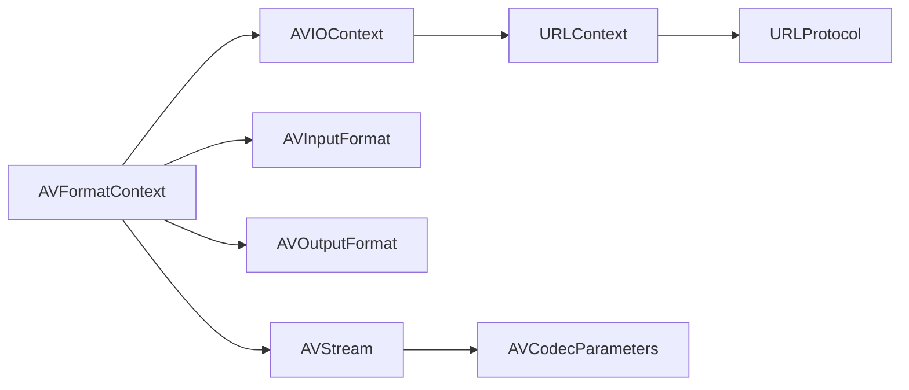
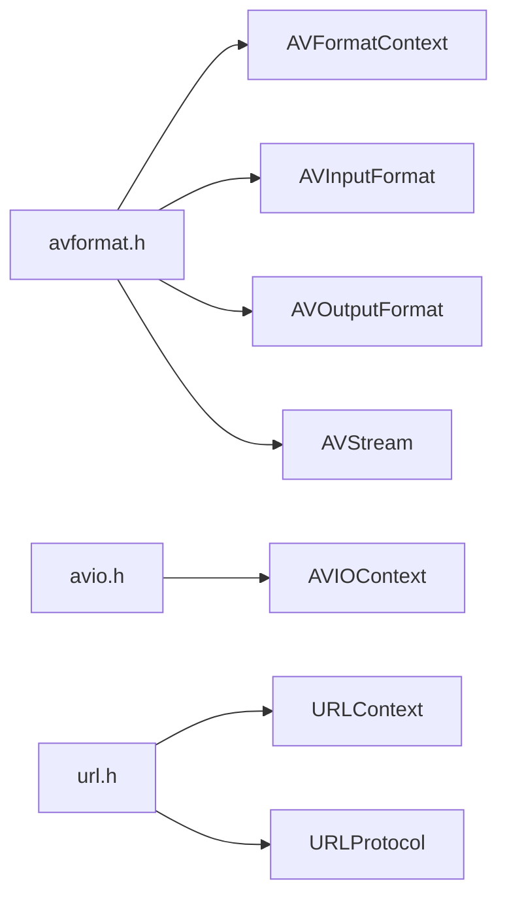
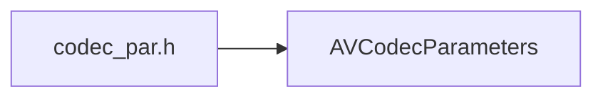

# learingFFmpeg

## 结构体之间的关系

```mermaid
graph LR

    AVFormatContext --> AVIOContext --> URLContext --> URLProtocol
    AVFormatContext --> AVInputFormat 
    AVFormatContext --> AVOutputFormat
    AVFormatContext --> AVStream --> AVCodecParameters
```

## avformat头文件

```mermaid
graph LR

    avformat.h --> AVFormatContext
    avformat.h --> AVInputFormat
    avformat.h --> AVOutputFormat
    avformat.h --> AVStream

    avio.h --> AVIOContext
    url.h --> URLContext
    url.h --> URLProtocol
```

## avcodec头文件

```mermaid
graph LR

    codec_par.h --> AVCodecParameters
```
