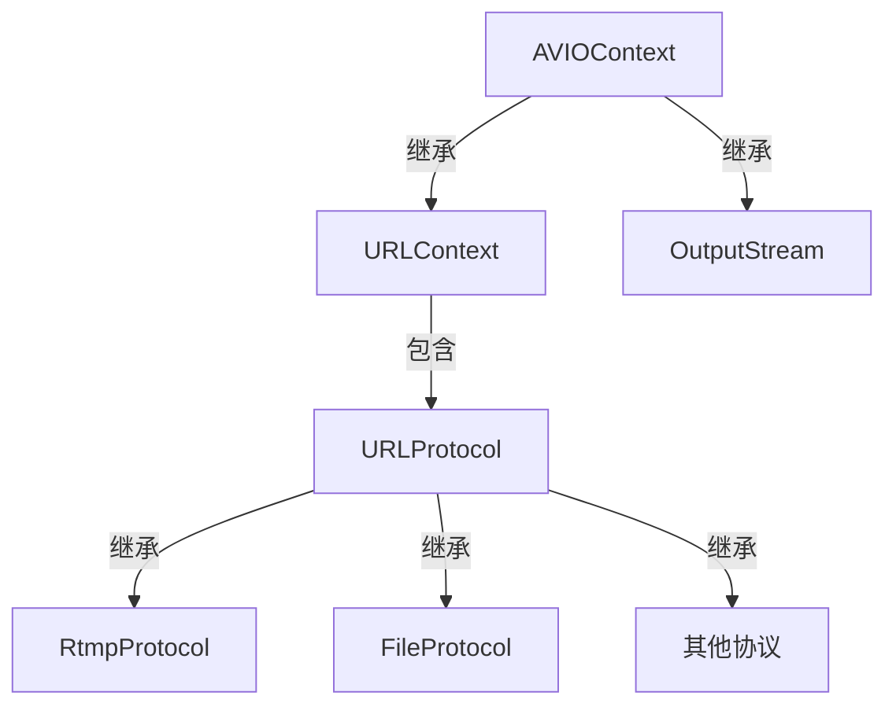
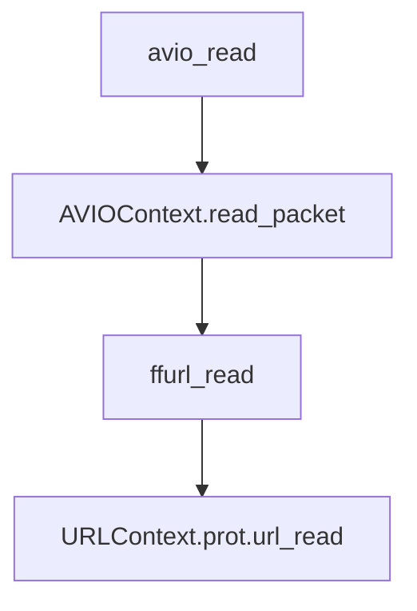

[toc]

## 三者之间的关系

#### 类图



#### 使用c++表示

```cpp
class IOBase
{
public:
    virtual int read_packet() = 0;
    virtual int write_packet() = 0;
}

class URLProtocolBase
{
public:
    virtual int url_open() = 0;
    virtual int url_close() = 0;
    virtual int url_read() = 0;
    virtual int url_write() = 0;

private:
    const char *name;
}

class URLContext : public IOBase
{
public:
    int read_packet() override{
        return prot_->url_read();
    };
    int write_packet() override{
        return prot_->url_write();
    };
private:
    URLProtocolBase *prot_;
    void *priv_data_;
    char *filename_;
    ...
}

class StreamOutput : public IOBase
{
public:
    int read_packet() override{
        // 具体实现... 
    };
    int write_packet() override{
        // 具体实现... 
    };
private:
    int bitrate;
    int first_stream;
    ...
}

class AVIOContext
{
public:
    int read_packet(){
        io_->read_packet();
    };
    int write_packet(){
        io_->write_packet();
    }
private:
    /*  IOBase是使用多态来实现下面这段c代码
        void *opaque;         
        int (*read_packet)(void *opaque, uint8_t *buf, int buf_size);
        int (*write_packet)(void *opaque, uint8_t *buf, int buf_size);
    */
   IOBase *io_;  
   uint8_t *buffer_;     
   int buffer_size_;
   ...
}
```

使用URLProtocol时，读取调用的路径为:



## AVIOContext

#### 使用场景

- 解封装：使用者在avformat_open_input()之前给定，或者avformat_open_input()给定。
- 封装：使用者在avformat_write_header()之前给定。

#### 操作接口

- `avio_alloc_context`
- `avio_context_free`
- `avio_write`
- `avio_open`
- `avio_open2`
- `avio_close`
- `avio_seek`
- `avio_read`
- `avio_flush`
- ...

#### 公开结构

```c
#include "libavformat/avio.h"
```

```c
typedef struct AVIOContext {

    const AVClass *av_class;
    unsigned char *buffer; 
    int buffer_size;   
    unsigned char *buf_ptr; 
    unsigned char *buf_end; 
    void *opaque;         
    int (*read_packet)(void *opaque, uint8_t *buf, int buf_size);
    int (*write_packet)(void *opaque, uint8_t *buf, int buf_size);
    int64_t (*seek)(void *opaque, int64_t offset, int whence);
    int64_t pos;   
    int eof_reached;    
    int error;         
    int write_flag;    
    int max_packet_size;
    int min_packet_size;  
    unsigned long checksum;
    unsigned char *checksum_ptr;
    unsigned long (*update_checksum)(unsigned long checksum, const uint8_t *buf, unsigned int size);
    int (*read_pause)(void *opaque, int pause);
    int64_t (*read_seek)(void *opaque, int stream_index, int64_t timestamp, int flags);
    int seekable;
    int direct;                    // 是否启用buffer对数据进行缓冲，如果启用buffer，read之前都会先调用fill_buffer对buffer进行填充
    const char *protocol_whitelist;
    const char *protocol_blacklist;
    int (*write_data_type)(void *opaque, uint8_t *buf, int buf_size, enum AVIODataMarkerType type, int64_t time);
    int ignore_boundary_point;
    unsigned char *buf_ptr_max;
    int64_t bytes_read;
    int64_t bytes_written;
} AVIOContext;
```

#### 内部结构

```c

typedef struct FFIOContext {
    AVIOContext pub;
    int (*short_seek_get)(void *opaque);
    int short_seek_threshold;
    enum AVIODataMarkerType current_type;
    int64_t last_time;
    int64_t maxsize;
    int64_t bytes_read;
    int64_t bytes_written;
    int seek_count;
    int writeout_count;
    int orig_buffer_size;
    int64_t written_output_size;
} FFIOContext;
```

## URLContext

#### 结构

```c
typedef struct URLContext {
    const AVClass *av_class;    /**< information for av_log(). Set by url_open(). */
    const struct URLProtocol *prot;
    void *priv_data;
    char *filename;             /**< specified URL */
    int flags;
    int max_packet_size;        /**< if non zero, the stream is packetized with this max packet size */
    int is_streamed;            /**< true if streamed (no seek possible), default = false */
    int is_connected;
    AVIOInterruptCB interrupt_callback;
    int64_t rw_timeout;         /**< maximum time to wait for (network) read/write operation completion, in mcs */
    const char *protocol_whitelist;
    const char *protocol_blacklist;
    int min_packet_size;        /**< if non zero, the stream is packetized with this min packet size */
} URLContext;
```

#### 方法

- `ffurl_alloc`
- `ffurl_connect`
- `ffurl_open_whitelist`
- `ffurl_accept`
- `ffurl_handshake`
- `ffurl_read`：调用prot->url_read
- `ffurl_write`
- `ffurl_seek`

## URLProtocol

这是一个纯接口结构，不同的协议有不同的实现

#### 结构

```c

typedef struct URLProtocol {
    const char *name;
    int     (*url_open)( URLContext *h, const char *url, int flags);
    int     (*url_open2)(URLContext *h, const char *url, int flags, AVDictionary **options);
    int     (*url_accept)(URLContext *s, URLContext **c);
    int     (*url_handshake)(URLContext *c);
    int     (*url_read)( URLContext *h, unsigned char *buf, int size);
    int     (*url_write)(URLContext *h, const unsigned char *buf, int size);
    int64_t (*url_seek)( URLContext *h, int64_t pos, int whence);
    int     (*url_close)(URLContext *h);
    int (*url_read_pause)(URLContext *h, int pause);
    int64_t (*url_read_seek)(URLContext *h, int stream_index,
                             int64_t timestamp, int flags);
    int (*url_get_file_handle)(URLContext *h);
    int (*url_get_multi_file_handle)(URLContext *h, int **handles,
                                     int *numhandles);
    int (*url_get_short_seek)(URLContext *h);
    int (*url_shutdown)(URLContext *h, int flags);
    const AVClass *priv_data_class;
    int priv_data_size;
    int flags;
    int (*url_check)(URLContext *h, int mask);
    int (*url_open_dir)(URLContext *h);
    int (*url_read_dir)(URLContext *h, AVIODirEntry **next);
    int (*url_close_dir)(URLContext *h);
    int (*url_delete)(URLContext *h);
    int (*url_move)(URLContext *h_src, URLContext *h_dst);
    const char *default_whitelist;
} URLProtocol;
```

#### 实体

```c
extern const URLProtocol ff_async_protocol;
extern const URLProtocol ff_bluray_protocol;
extern const URLProtocol ff_cache_protocol;
extern const URLProtocol ff_concat_protocol;
extern const URLProtocol ff_concatf_protocol;
extern const URLProtocol ff_crypto_protocol;
extern const URLProtocol ff_data_protocol;
extern const URLProtocol ff_ffrtmpcrypt_protocol;
extern const URLProtocol ff_ffrtmphttp_protocol;
extern const URLProtocol ff_file_protocol;
extern const URLProtocol ff_ftp_protocol;
extern const URLProtocol ff_gopher_protocol;
extern const URLProtocol ff_gophers_protocol;
extern const URLProtocol ff_hls_protocol;
extern const URLProtocol ff_http_protocol;
extern const URLProtocol ff_httpproxy_protocol;
extern const URLProtocol ff_https_protocol;
extern const URLProtocol ff_icecast_protocol;
extern const URLProtocol ff_mmsh_protocol;
extern const URLProtocol ff_mmst_protocol;
extern const URLProtocol ff_md5_protocol;
extern const URLProtocol ff_pipe_protocol;
extern const URLProtocol ff_prompeg_protocol;
extern const URLProtocol ff_rtmp_protocol;
extern const URLProtocol ff_rtmpe_protocol;
extern const URLProtocol ff_rtmps_protocol;
extern const URLProtocol ff_rtmpt_protocol;
extern const URLProtocol ff_rtmpte_protocol;
extern const URLProtocol ff_rtmpts_protocol;
extern const URLProtocol ff_rtp_protocol;
extern const URLProtocol ff_sctp_protocol;
extern const URLProtocol ff_srtp_protocol;
extern const URLProtocol ff_subfile_protocol;
extern const URLProtocol ff_tee_protocol;
extern const URLProtocol ff_tcp_protocol;
extern const URLProtocol ff_tls_protocol;
extern const URLProtocol ff_udp_protocol;
extern const URLProtocol ff_udplite_protocol;
extern const URLProtocol ff_unix_protocol;
extern const URLProtocol ff_libamqp_protocol;
extern const URLProtocol ff_librist_protocol;
extern const URLProtocol ff_librtmp_protocol;
extern const URLProtocol ff_librtmpe_protocol;
extern const URLProtocol ff_librtmps_protocol;
extern const URLProtocol ff_librtmpt_protocol;
extern const URLProtocol ff_librtmpte_protocol;
extern const URLProtocol ff_libsrt_protocol;
extern const URLProtocol ff_libssh_protocol;
extern const URLProtocol ff_libsmbclient_protocol;
extern const URLProtocol ff_libzmq_protocol;
extern const URLProtocol ff_ipfs_protocol;
extern const URLProtocol ff_ipns_protocol;
```
