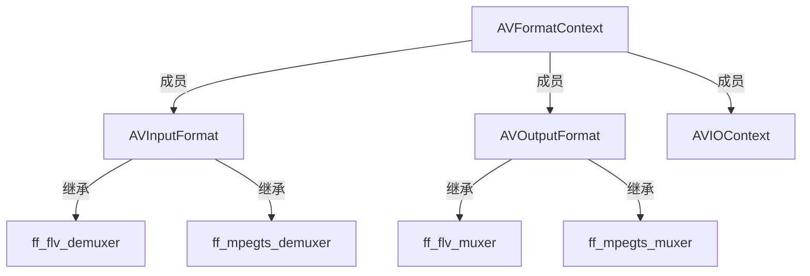

[toc]
## 三者之间的关系

#### 类图

muxer与demuxer的实例可在`libavformat/allformats.c`中查看

#### 使用c++类表示
```cpp
// 抽象接口类
class AVInputFormatBase
{
public: 
    virtual int read_probe() = 0;
    virtual int read_header() = 0;
    ...
private:
    const char *name;
    ...
}
// 子类实现
class MpegTsInputFormat : public AVInputFormatBase
{
public:
    int read_probe() override;
    int read_header() override;
}

// 抽象接口类
class AVOutputFormatBase
{
public:
    virtual int write_header() = 0;
    virtual int write_packet() = 0;
    ...
private:
    const char *name;
    ...
}

class AVFormatContext
{
public:
    AVInputFormatBase *input_fmt;       // 方法使用抽象接口
    AVOutputFormatBase *output_fmt;     // 
    AVIOContext *pb;                    // io句柄放在外面,封装层可以使用:(AVFormatContext*)s->pb->read_packet()
    ...
private:
    unsigned int nb_streams;            // 成员自己保存
    AVStream **streams;
    char *url;
    ...
}
```


## AVFormatContext

#### 结构
```c
typedef struct AVFormatContext {
    const AVClass *av_class;
    const struct AVInputFormat *iformat;
    const struct AVOutputFormat *oformat;
    void *priv_data;
    AVIOContext *pb;
    int ctx_flags;
    unsigned int nb_streams;
    AVStream **streams;
    char *url;
    int64_t start_time;
    int64_t duration;
    int64_t bit_rate;
    unsigned int packet_size;
    int max_delay;
    int flags;
    int64_t probesize;
    int64_t max_analyze_duration;
    const uint8_t *key;
    int keylen;
    unsigned int nb_programs;
    AVProgram **programs;
    enum AVCodecID video_codec_id;
    enum AVCodecID audio_codec_id;
    enum AVCodecID subtitle_codec_id;
    unsigned int max_index_size;
    unsigned int max_picture_buffer;
    unsigned int nb_chapters;
    AVChapter **chapters;
    AVDictionary *metadata;
    int64_t start_time_realtime;
    int fps_probe_size;
    int error_recognition;
    AVIOInterruptCB interrupt_callback;
    int debug;
    int64_t max_interleave_delta;
    int strict_std_compliance;
    int event_flags;
    int max_ts_probe;
    int avoid_negative_ts;
    int ts_id;
    int audio_preload;
    int max_chunk_duration;
    int max_chunk_size;
    int use_wallclock_as_timestamps;
    int avio_flags;
    enum AVDurationEstimationMethod duration_estimation_method;
    int64_t skip_initial_bytes;
    unsigned int correct_ts_overflow;
    int seek2any;
    int flush_packets;
    int probe_score;
    int format_probesize;
    char *codec_whitelist;
    char *format_whitelist;
    int io_repositioned;
    const AVCodec *video_codec;
    const AVCodec *audio_codec;
    const AVCodec *subtitle_codec;
    const AVCodec *data_codec;
    int metadata_header_padding;
    void *opaque;
    av_format_control_message control_message_cb;
    int64_t output_ts_offset;
    uint8_t *dump_separator;
    enum AVCodecID data_codec_id;
    char *protocol_whitelist;
    int (*io_open)(struct AVFormatContext *s, AVIOContext **pb, const char *url,
                   int flags, AVDictionary **options);
    void (*io_close)(struct AVFormatContext *s, AVIOContext *pb);
    char *protocol_blacklist;
    int max_streams;
    int skip_estimate_duration_from_pts;
    int max_probe_packets;
    int (*io_close2)(struct AVFormatContext *s, AVIOContext *pb);
} AVFormatContext;

```

## AVInputFormat

#### 结构
```c
typedef struct AVInputFormat {
    const char *name;
    const char *long_name;
    int flags;
    const char *extensions;
    const struct AVCodecTag * const *codec_tag;
    const AVClass *priv_class; ///< AVClass for the private context
    const char *mime_type;
    int raw_codec_id;
    int priv_data_size;
    int flags_internal;
    int (*read_probe)(const AVProbeData *);
    int (*read_header)(struct AVFormatContext *);
    int (*read_packet)(struct AVFormatContext *, AVPacket *pkt);
    int (*read_close)(struct AVFormatContext *);
    int (*read_seek)(struct AVFormatContext *,
                     int stream_index, int64_t timestamp, int flags);
    int64_t (*read_timestamp)(struct AVFormatContext *s, int stream_index,
                              int64_t *pos, int64_t pos_limit);
    int (*read_play)(struct AVFormatContext *);
    int (*read_pause)(struct AVFormatContext *);
    int (*read_seek2)(struct AVFormatContext *s, int stream_index, int64_t min_ts, int64_t ts, int64_t max_ts, int flags);
    int (*get_device_list)(struct AVFormatContext *s, struct AVDeviceInfoList *device_list);
} AVInputFormat;
```

#### 读取过程
读文件->mpegts解封装堆栈如下
```
file_read(URLContext * h, unsigned char * buf, int size) (\home\watt\learning_ffmpeg\ffmpeg-5.1\libavformat\file.c:113)
retry_transfer_wrapper(URLContext * h, uint8_t * buf, int size, int size_min, int (*)(URLContext *, uint8_t *, int) transfer_func) (\home\watt\learning_ffmpeg\ffmpeg-5.1\libavformat\avio.c:370)
ffurl_read(URLContext * h, unsigned char * buf, int size) (\home\watt\learning_ffmpeg\ffmpeg-5.1\libavformat\avio.c:405)
read_packet_wrapper(AVIOContext * s, uint8_t * buf, int size) (\home\watt\learning_ffmpeg\ffmpeg-5.1\libavformat\aviobuf.c:533)
fill_buffer(AVIOContext * s) (\home\watt\learning_ffmpeg\ffmpeg-5.1\libavformat\aviobuf.c:577)
avio_read(AVIOContext * s, unsigned char * buf, int size) (\home\watt\learning_ffmpeg\ffmpeg-5.1\libavformat\aviobuf.c:672)
ffio_read_indirect(AVIOContext * s, unsigned char * buf, int size, const unsigned char ** data) (\home\watt\learning_ffmpeg\ffmpeg-5.1\libavformat\aviobuf.c:709)
read_packet(AVFormatContext * s, uint8_t * buf, int raw_packet_size, const uint8_t ** data) (\home\watt\learning_ffmpeg\ffmpeg-5.1\libavformat\mpegts.c:2942)
handle_packets(MpegTSContext * ts, int64_t nb_packets) (\home\watt\learning_ffmpeg\ffmpeg-5.1\libavformat\mpegts.c:3009)
mpegts_read_packet(AVFormatContext * s, AVPacket * pkt) (\home\watt\learning_ffmpeg\ffmpeg-5.1\libavformat\mpegts.c:3256)
ff_read_packet(AVFormatContext * s, AVPacket * pkt) (\home\watt\learning_ffmpeg\ffmpeg-5.1\libavformat\demux.c:571)
read_frame_internal(AVFormatContext * s, AVPacket * pkt) (\home\watt\learning_ffmpeg\ffmpeg-5.1\libavformat\demux.c:1245)
av_read_frame(AVFormatContext * s, AVPacket * pkt) (\home\watt\learning_ffmpeg\ffmpeg-5.1\libavformat\demux.c:1450)
```
- `ff_read_packet`调用了`s->iformat->read_packet`，这是个接口，挂上了`ff_mpegts_demuxer.mpegts_read_packet`
- `ff_mpegts_demuxer.mpegts_read_packet`读取buffer内容时调用`avio_read`，一直调用到`(AVIOContext)s.read_packet`，这是个函数指针，挂上URLContext的`ffurl_read`，最后调用到`(URLContext)h.prot.url_read`，这是个接口，挂上`ff_file_protocol.file_read`

## AVOutputFormat

#### 结构
```c
typedef struct AVOutputFormat {
    const char *name;
    const char *long_name;
    const char *mime_type;
    const char *extensions; 
    enum AVCodecID audio_codec;   
    enum AVCodecID video_codec;   
    enum AVCodecID subtitle_codec; 
    int flags;
    const struct AVCodecTag * const *codec_tag;
    const AVClass *priv_class;
    int priv_data_size;
    int flags_internal;
    int (*write_header)(struct AVFormatContext *);
    int (*write_packet)(struct AVFormatContext *, AVPacket *pkt);
    int (*write_trailer)(struct AVFormatContext *);
    int (*interleave_packet)(struct AVFormatContext *s, AVPacket *pkt,
                             int flush, int has_packet);
    int (*query_codec)(enum AVCodecID id, int std_compliance);
    void (*get_output_timestamp)(struct AVFormatContext *s, int stream,
                                 int64_t *dts, int64_t *wall);
    int (*control_message)(struct AVFormatContext *s, int type,
                           void *data, size_t data_size);
    int (*write_uncoded_frame)(struct AVFormatContext *, int stream_index,
                               AVFrame **frame, unsigned flags);
    int (*get_device_list)(struct AVFormatContext *s, struct AVDeviceInfoList *device_list);
    enum AVCodecID data_codec; 
    int (*init)(struct AVFormatContext *);
    void (*deinit)(struct AVFormatContext *);
    int (*check_bitstream)(struct AVFormatContext *s, struct AVStream *st,
                           const AVPacket *pkt);
} AVOutputFormat;
```

## avformat_open_input
打开文件的堆栈如下:
```
libavformat.so.59! file_open(URLContext * h, const char * filename, int flags) (\home\watt\learning_ffmpeg\ffmpeg-5.1\libavformat\file.c:208)
libavformat.so.59! ffurl_connect(URLContext * uc, AVDictionary ** options) (\home\watt\learning_ffmpeg\ffmpeg-5.1\libavformat\avio.c:210)
libavformat.so.59! ffurl_open_whitelist(URLContext ** puc, const char * filename, int flags, const AVIOInterruptCB * int_cb, AVDictionary ** options, const char * whitelist, const char * blacklist, URLContext * parent) (\home\watt\learning_ffmpeg\ffmpeg-5.1\libavformat\avio.c:347)
libavformat.so.59! ffio_open_whitelist(AVIOContext ** s, const char * filename, int flags, const AVIOInterruptCB * int_cb, AVDictionary ** options, const char * whitelist, const char * blacklist) (\home\watt\learning_ffmpeg\ffmpeg-5.1\libavformat\aviobuf.c:1238)
libavformat.so.59! io_open_default(AVFormatContext * s, AVIOContext ** pb, const char * url, int flags, AVDictionary ** options) (\home\watt\learning_ffmpeg\ffmpeg-5.1\libavformat\options.c:151)
libavformat.so.59! init_input(AVFormatContext * s, const char * filename, AVDictionary ** options) (\home\watt\learning_ffmpeg\ffmpeg-5.1\libavformat\demux.c:174)
libavformat.so.59! avformat_open_input(AVFormatContext ** ps, const char * filename, const AVInputFormat * fmt, AVDictionary ** options) (\home\watt\learning_ffmpeg\ffmpeg-5.1\libavformat\demux.c:254)
main(int argc, char ** argv) (\home\watt\learning_ffmpeg\self-project\hello.cc:40)
```
- 使用默认的`io_open_default`来打开`URLContext`
- 在`init_input`中使用函数`url_find_protocol`来找到正确的`URLProtocol`
- `ffurl_connect`里面调用了`uc>prot->url_open`,这时候已挂上了`ff_file_protocol`,因此调用到了`file_open`来打开文件