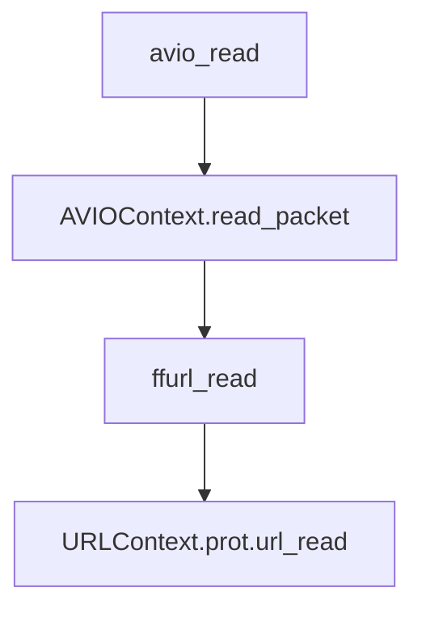

[toc]

整个protocol层，读取时调用的路径为:



## AVIOContext

#### 使用场景
- 解封装：使用者在avformat_open_input()之前给定，或者avformat_open_input()给定。
- 封装：使用者在avformat_write_header()之前给定。

#### 接口
- `avio_alloc_context`
- `avio_context_free`
- `avio_write`
- `avio_open`
- `avio_open2`
- `avio_close`
- `avio_seek`
- `avio_read`
- `avio_flush`
  
#### 公开结构
```c
#include "libavformat/avio.h"
```

```c
typedef struct AVIOContext {

    const AVClass *av_class;
    unsigned char *buffer; 
    int buffer_size;     
    unsigned char *buf_ptr; 
    unsigned char *buf_end; 
    void *opaque;           
    int (*read_packet)(void *opaque, uint8_t *buf, int buf_size);
    int (*write_packet)(void *opaque, uint8_t *buf, int buf_size);
    int64_t (*seek)(void *opaque, int64_t offset, int whence);
    int64_t pos;   
    int eof_reached;      
    int error;           
    int write_flag;      
    int max_packet_size;
    int min_packet_size;  
    unsigned long checksum;
    unsigned char *checksum_ptr;
    unsigned long (*update_checksum)(unsigned long checksum, const uint8_t *buf, unsigned int size);
    int (*read_pause)(void *opaque, int pause);
    int64_t (*read_seek)(void *opaque, int stream_index, int64_t timestamp, int flags);
    int seekable;
    int direct;
    const char *protocol_whitelist;
    const char *protocol_blacklist;
    int (*write_data_type)(void *opaque, uint8_t *buf, int buf_size, enum AVIODataMarkerType type, int64_t time);
    int ignore_boundary_point;
    unsigned char *buf_ptr_max;
    int64_t bytes_read;
    int64_t bytes_written;
} AVIOContext;
```

#### 内部结构

```c

typedef struct FFIOContext {
    AVIOContext pub;
    int (*short_seek_get)(void *opaque);
    int short_seek_threshold;
    enum AVIODataMarkerType current_type;
    int64_t last_time;
    int64_t maxsize;
    int64_t bytes_read;
    int64_t bytes_written;
    int seek_count;
    int writeout_count;
    int orig_buffer_size;
    int64_t written_output_size;
} FFIOContext;
```


## URLContext


#### 结构
```c
typedef struct URLContext {
    const AVClass *av_class;    /**< information for av_log(). Set by url_open(). */
    const struct URLProtocol *prot;
    void *priv_data;
    char *filename;             /**< specified URL */
    int flags;
    int max_packet_size;        /**< if non zero, the stream is packetized with this max packet size */
    int is_streamed;            /**< true if streamed (no seek possible), default = false */
    int is_connected;
    AVIOInterruptCB interrupt_callback;
    int64_t rw_timeout;         /**< maximum time to wait for (network) read/write operation completion, in mcs */
    const char *protocol_whitelist;
    const char *protocol_blacklist;
    int min_packet_size;        /**< if non zero, the stream is packetized with this min packet size */
} URLContext;
```

#### 方法
- `ffurl_alloc`
- `ffurl_connect`
- `ffurl_open_whitelist`
- `ffurl_accept`
- `ffurl_handshake`
- `ffurl_read`：调用prot->url_read
- `ffurl_write`
- `ffurl_seek`


## URLProtocol
这是一个纯接口结构，不同的协议有不同的实现

#### 结构
```c

typedef struct URLProtocol {
    const char *name;
    int     (*url_open)( URLContext *h, const char *url, int flags);
    int     (*url_open2)(URLContext *h, const char *url, int flags, AVDictionary **options);
    int     (*url_accept)(URLContext *s, URLContext **c);
    int     (*url_handshake)(URLContext *c);
    int     (*url_read)( URLContext *h, unsigned char *buf, int size);
    int     (*url_write)(URLContext *h, const unsigned char *buf, int size);
    int64_t (*url_seek)( URLContext *h, int64_t pos, int whence);
    int     (*url_close)(URLContext *h);
    int (*url_read_pause)(URLContext *h, int pause);
    int64_t (*url_read_seek)(URLContext *h, int stream_index,
                             int64_t timestamp, int flags);
    int (*url_get_file_handle)(URLContext *h);
    int (*url_get_multi_file_handle)(URLContext *h, int **handles,
                                     int *numhandles);
    int (*url_get_short_seek)(URLContext *h);
    int (*url_shutdown)(URLContext *h, int flags);
    const AVClass *priv_data_class;
    int priv_data_size;
    int flags;
    int (*url_check)(URLContext *h, int mask);
    int (*url_open_dir)(URLContext *h);
    int (*url_read_dir)(URLContext *h, AVIODirEntry **next);
    int (*url_close_dir)(URLContext *h);
    int (*url_delete)(URLContext *h);
    int (*url_move)(URLContext *h_src, URLContext *h_dst);
    const char *default_whitelist;
} URLProtocol;
```
